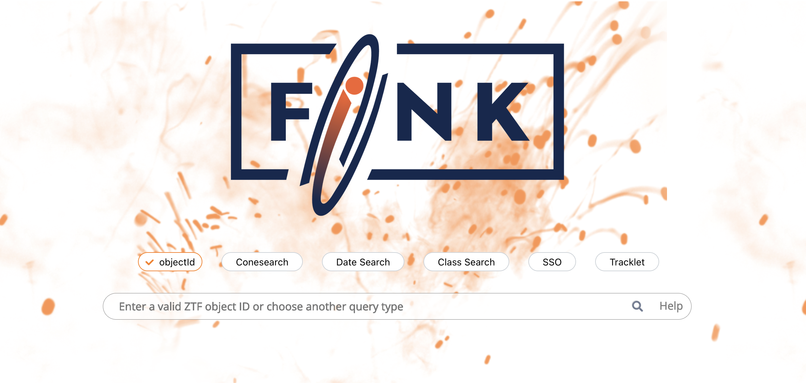

# Fink Science Portal

[](https://github.com/astrolabsoftware/fink-science-portal/actions?query=workflow%3APEP8)



The Fink Science Portal allows users to browse and display alert data collected and processed by Fink from a web browser: [https://fink-portal.org](https://fink-portal.org).

The backend is using [Apache HBase](https://hbase.apache.org/), a distributed non-relational database. The frontend is based on [Dash](https://plotly.com/dash/), a Python web framework built on top of Flask, Plotly and React. The frontend has also integrated components to perform fit on the data, such as [nifty-ls](https://github.com/flatironinstitute/nifty-ls) for variable stars, or the [imcce](https://ssp.imcce.fr/webservices/miriade/) tools for Solar System objects.

## Backend structure

After each observation night, the data is aggregated and pushed into Apache HBase tables. The main table contains all alert data processed by Fink since 2019-11-01. This represents more than 271 million alerts collected, and about 184 million scientifically valid as of 01/2025. The main table data is indexed along the `objectId` of alerts, and the emission date `jd`.

In order to allow multi-indexing with HBase, we create _index tables_. These tables are indexed along different properties (time, sky position, classification, ...). They contain the same number of rows than the main table but fewer columns. These index tables are used to perform fast search along arbitrary properties and isolate interesting candidates, while the main table is used to display final data.

We developed custom HBase clients to manipulate the data efficiently (Lomikel, FinkBrowser, more information [here](https://hrivnac.web.cern.ch/hrivnac/Activities/index.html)).

## Local deployment

The portal has been tested on Python 3.9 to 3.11. Other versions might work. First you need to install the Python dependencies:

```bash
python -m venv portal_env
source portal_env/bin/activate

pip install -r requirements.txt
```

The default configuration file (`config.yml`) should be enough to deploy, so just execute:

```bash
python index.py
```

and navigate to [http://localhost:24000/](http://localhost:24000/).

### Telemetry

You can easily turn telemetry on to inspect the site performance. Just define `export DASH_TELEMETRY=1` and restart the application. Now whenever you do an action, you will see similar log in your terminal:

```bash
[TELEMETRY] __main__:results, 0.7114s
___input:|search_bar_input.n_submit:1||search_bar_submit.n_clicks:0||url.search:|
___state:|search_bar_input.value:class="Early SN Ia c||search_history_store.data:None||results_table_switch.checked:False|
__output:|{'id': 'results', 'property': 'children'}.children:([Row(children=[Col(|
[TELEMETRY] __main__:update_search_history_menu, 0.0001s
___input:|search_history_store.timestamp:None||search_history_store.data:['class="Early SN Ia|
___state:||
__output:|search_history_menu.children:[MenuLabel('Search h|
[TELEMETRY] __main__:display_skymap, 0.0000s
___input:|result_table.data:[{'d:DR3Name': 'nan'||result_table.columns:None||modal_skymap.is_open:False|
___state:||
__output:|aladin-lite-div-skymap.run:<dash._callback.NoUp|
[TELEMETRY] __main__:on_paginate, 0.1105s
___input:|results_pagination.value:1|
___state:|results_store.data:{"d:DR3Name":{"0":"n||results_page_size_store.data:10|
__output:|results_paginated.children:[Card(children=[Card|
[TELEMETRY] __main__:on_load_lightcurve, 0.1956s
___input:|{"index":7,"objectId":"ZTF25aabpoxz","type":"search_results_lightcurve"}.id:{'type': 'search_res|
___state:||
__output:|{'index': 7, 'objectId': 'ZTF25aabpoxz', 'type': 'search_results_lightcurve'}.children:Graph(config={'displ|
```

## Cloud deployment

The procedure for developpers and maintainers can be found on the [Fink GitLab](https://gitlab.in2p3.fr/fink/rubin-performance-check/-/blob/main/portal/README.md?ref_type=heads) repository (auth required).
